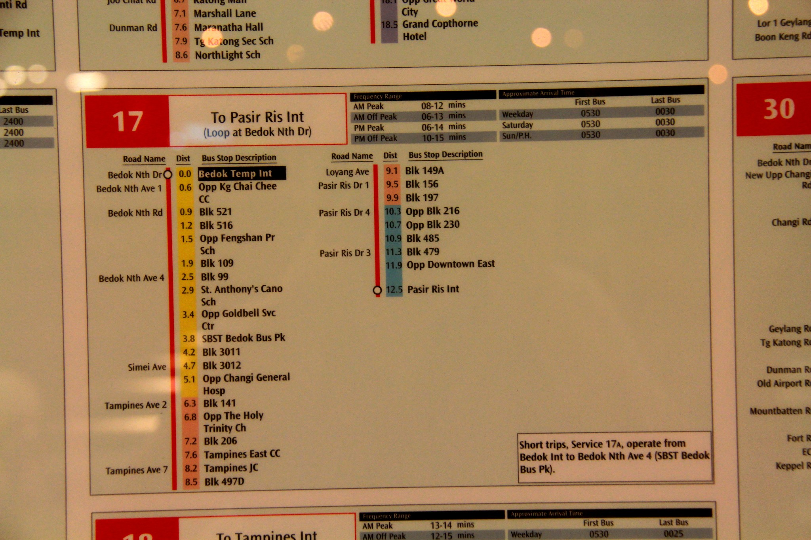
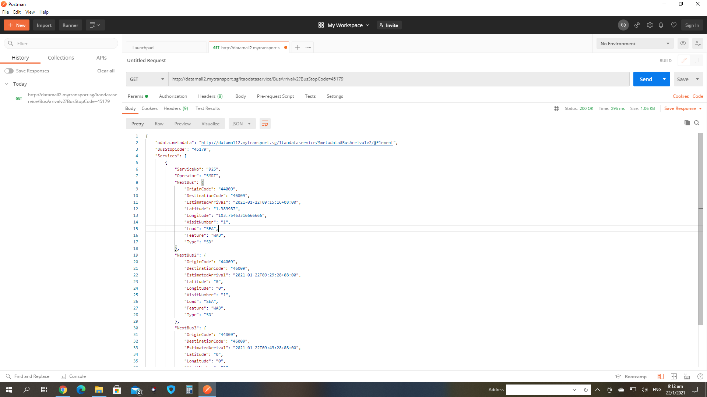
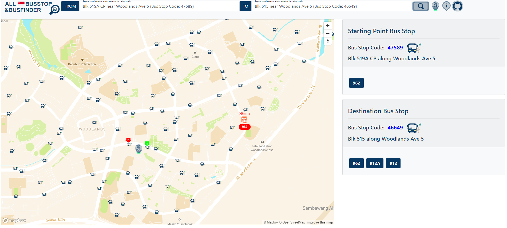
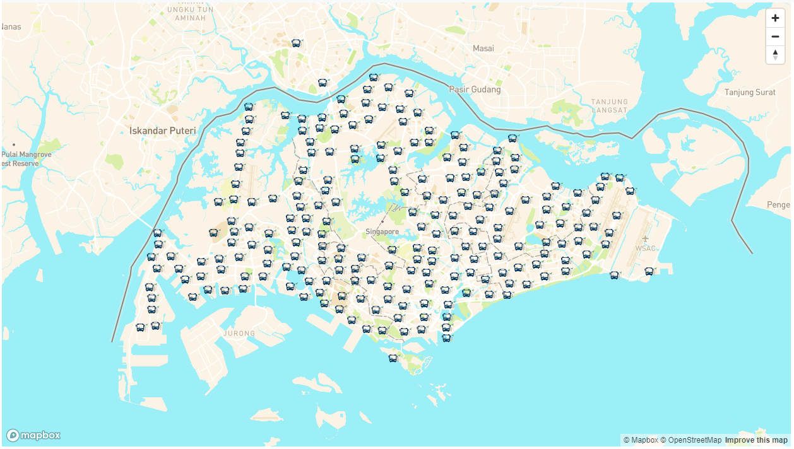
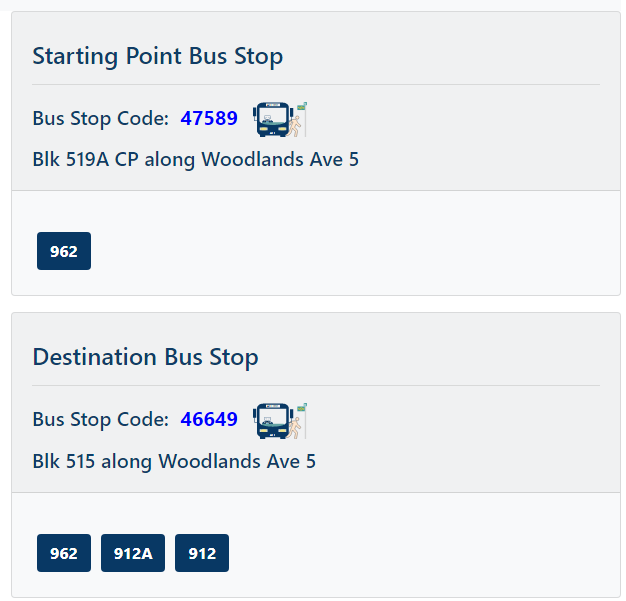
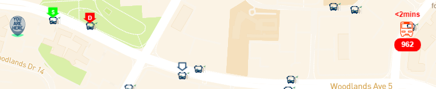

# Milestone Project 2 Interactive Front-End Development - AlightLiaoLah (ALL) Singapore Bus Stop and Bus Finder

The landing page of AlightLiaoLah (ALL) Singapore Bus Stop and Bus Finder
<br/><br/>

Demonstration of AlightLiaoLah (ALL) Singapore Bus Stop and Bus Finder

## Problem Statement

Travelling around in Singapore by public bus is a common transport that most of us would inevitably use in our daily communte. From transition between different type of transport to long distance travelling, public bus provides the cheapest and accessible means to reach our destination. Moreover, many of the bus stop are located near common amenties or landmarks, which makes it a prefer choice among the rest of the public transport. 

Despite its popularity, finding information about a bus service route or available bus service or bus stop location could be difficult, especially when you are at unfamiliar places. Also, interpretation of bus stop display information could also be challenging if one doesn't has good sense of orientation (see figure below).



To overcome this inadequacy, many would search online for bus route, location, or street name and this information is usually built into an app or web page which encompasses an interactive map showing the real-time location of bus and routes. To aid app developer, [Bus information api]("https://datamall.lta.gov.sg/content/datamall/en/dynamic-data.html") is also available with information on the bus service no, arrival time etc (see below figure).





Hence, by leveraging on technology such as a bus information api, this application was made to address this problem.
<br/><br/>

## UX
Realization of this project depends on the availability of users and technologies. Users would be public bus commuters or individual who has lost his/her way at some unfamiliar places. This application should fulfill their following needs:

- "I want to find the nearest bus stop from my location within a walkable distance."
- "I want to find the bus stop which I need to alight."
- "I want to find a particular bus stop."
- "I want to know where is the bus now."
- "I want to know my current location."
- "I want to know when is the bus going to arrival."
- "I want to know what are the bus services available at the bus stop."
- "I want to know the name of the street or road or bus stop code."

By using front-end and back-end technologies such as bootstrap,  restful api, the user's needs can be achieved. This application would present a landing page of a singapore map with clickable buttons and text boxes for user's inputs. It would provides user on the location of the bus, bus stop and user, as well as real-time information of a bus stop and bus.  A wireframe of this application can be found here [here](https://xd.adobe.com/view/fbc25fb5-8cc7-4cdf-afc6-19bc692072b8-ae91/).

## Features


<br/><br/>

### Existing Feature
- <br/>
  ***From/To Query Boxes*** - This feature allow user to input a starting point or destination bus stop code or road name or street name.
<br/><br/>


- <br/>
  
  ***Buttons*** - (From left to right) The "YOU ARE HERE" button allow user to retrieve current location information to the application, which will be filled into the "FROM" query box. The "i" button is a help feature that display information about this application and user instructions. The github icon button links to the git repository of this application.
  <br/><br/>

- 
  <br/>

  ***Bus Stops on Map*** - This feature allow user to click the bus stop icon on the map to retrieve bus stop information and displayed onto the bus stop information card.The codes to be able to click onto each bus stop icon is partially extracted from app.js as shown below:

  ```
  map.on("click", "fullbuststopcode", function (e) {//codes 
  ....}
  ```
  <br/>
- 
  <br/>

  ***Bus Information Cards*** - This feature displays information of a bus stop. 
  <br/><br/>

- 
  <br/>

  ***Map Markers*** - (From left to right) "YOU ARE HERE" shows the current location of the on the map. The animated Green "S" and red "D" markers show the locations of the address or bus stop code in the "FROM" and "TO" query boxes. The animated white down arrow marker indicates selected bus stop on the map by the user. The animated red bus shows real time location of a bus with its service number and arrival time to the queried bus stop. The codes to make each marker is partially extracted from app.js as shown below:

  ```
  function makedommarker(
    map,
    markerid,
    imgsrc,
    width,
    height,
    clickedlong,
    clickedlat,
    busno = "",
    busarr = ""
  ) {//codes 
  ....}
  ```

<br/>
  
### Feature Left to Implement
- ***Bus Path/Route between Starting Point and Destination with user location***<br/>
  This feature will shows the path between the starting point to the destination together with the user location. This can also be shown on the bus card information.<br/><br/> 
- ***Alight Alert***<br/> This feature will reminds the user when to alight from the bus.
  <br/><br/>
- ***Bus Service Number Recommendation***<br/>
  This feature will guide the user which bus service number to board in order to reach the destination.
<br/><br/>
## Technologies Used

- [HTML/CSS](https://html.com/)<br/>
The project uses HTML/CSS for base template and styling of the landing page.
- [Javascript](javascript.com)<br/>
The project uses Javascript as the primary programming language.
- [Bootstrap](getbootstrap.com)<br/>
The project uses Bootstrap for the responsive for different screens size.
- [SVG Animation](css-tricks.com/guide-svg-animations-smil/)<br/>
The project uses SVG animation for the animation of markers.
- [Inkscape](https://inkscape.org/)<br/>
The project uses inkscape for creating svg files.
- [MapboxGL JS](docs.mapbox.com/mapbox-gl-js/api/)<br/>
The project uses MapboxGL.js for manipulation of map using javascript.
- [Mapbox Studio](docs.mapbox.com/studio-manual/guides/)<br/>
The project uses Mapbox Studio for manipulation of map to include bus stop location and icons.
- [JQuery UI](jqueryui.com)<br/>
The project uses JQuery UI for the autocomplete function when user type into the query boxes.
- [JQuery](https://jquery.com/)<br/>
The project uses JQuery to ease the manipulation of DOM. 
- [Jupyter Notebook](jupyter.org)<br/>
The project uses Jupyter Notebook for the creation of the bus stop location geodata to be used in the mapbox studio. 
- [Heroku](https://www.heroku.com/)<br/>
The project uses Heroku to host the cors anywhere instance to address the [CORS setting issue](developer.mozilla.org/en-US/docs/Web/HTTP/CORS/Errors) when pulling from the bus stop information api. 
<br/><br/>

## Testing

|Features Testing|
| :------- |
|**Test 1: Floating Label moved higher after clicked into the query boxes**|
| **Expected:** The floating label "Type a read name/street name/bus stoop code" should move higher when clicked onto the query boxes.<br/>**Test:** Click onto the query boxes.<br/>**Result:** The floating label "Type a read name/street name/bus stoop code" should moved higher when clicked onto the query boxes.<br/>|
|Test 2: Autocomplete menu appeared for user queries of more than 4 characters|
|:-------|
|**Expected:** The autocomplete menu should appear if more than 4 characters are typed into the query boxes.<br/>**Test:** Type in more than 4 characters in the query boxes.<br/>**Result:** The autocomplete menu appeared when more than 4 characters are typed into the query boxes.<br/>|

|Test 3: Autocomplete menu does not appeared for user queries of less than 4 characters|
|:-------|
|**Expected:** The autocomplete menu should not appear if less than 4 characters are typed into the query boxes.<br/>**Test:** Type in less than 4 characters in the query boxes.<br/>**Result:** The autocomplete menu does not appeared when less than 4 characters are typed into the query boxes.<br/>|

|Test 4: Autocomplete menu appear for user queries of bus stop codes numbers|
|:-------|
|**Expected:** The autocomplete menu should appear if bus stop code number of more than 4 characters are typed into the query boxes.<br/>**Test:** Type in more than 4 characters of bus stop code number in the query boxes.<br/>**Result:** The autocomplete menu appeared for bus stop code number of more than 4 characters are typed into the query boxes.<br/>|


## Bugs/Problems Encountered


https://search.google.com/test/mobile-friendly


## Deployment

The website is hosted using github page and can be accessed via [here]( https://simplyedwin.github.io/tcg_codeinstitute_project_2/).


## Credits

### Media
 Bus stop display board photo was obtained from [LandTransportGuru](https://www.google.com/search?q=bus%20routing%20information%20at%20bus%20stop&tbm=isch&tbs=rimg:CT679JLzyUtsYdwbmfa5wM9v&rlz=1C1CHBF_enSG748SG748&hl=en&sa=X&ved=0CBsQuIIBahcKEwio7vmusq3uAhUAAAAAHQAAAAAQLw&biw=1519&bih=674#imgrc=d53gD2hDpEValM)


### Acknowledgements

Geodatasource on the sample code for the calculation of distance between 2 coordiates [distance](https://www.geodatasource.com/developers/javascript)

Trent colleage staff and classmates for feedbacks on website design

Design of logo are sourced from [Freepik](https://www.flaticon.com/authors/freepik)

Reference script for [toast](https://www.w3schools.com/howto/tryit.asp?filename=tryhow_js_snackbar)

Bootstrap 4 floating label css from [floatinglabel](https://www.cssscript.com/pure-css-floating-label-pattern-bootstrap/)

Readme template from [Code Institute](https://github.com/Code-Institute-Solutions/readme-template)
