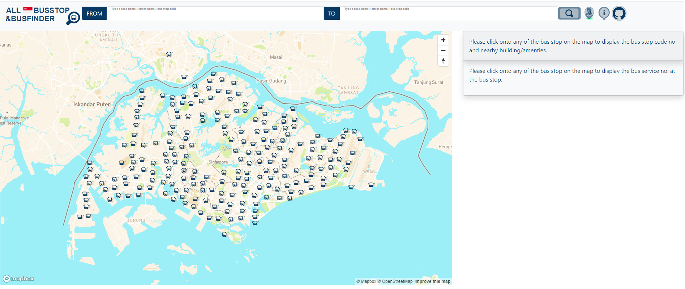

# Milestone Project 2 Interactive Front-End Development - AlightLiaoLah (ALL) Singapore Bus Stop and Bus Finder

The landing page of AlightLiaoLah (ALL) Singapore Bus Stop and Bus Finder
  

Demonstration of AlightLiaoLah (ALL) Singapore Bus Stop and Bus Finder

## Problem Statement

Travelling around in Singapore by public bus is a common transport that most of us would inevitably use in our daily communte. From transition between different type of transport to long distance travelling, public bus provides the cheapest and accessible means to reach our destination. Moreover, many of the bus stop are located near common amenties or landmarks, which makes it a prefer choice among the rest of the public transport. 

Despite its popularity, finding information about a bus service route or available bus service or bus stop location can be difficult, especially when you are at unfamiliar places. Also, interpretation of bus stop display information could also be challenging if one doesn't has good sense of orientation (see figure below).

To overcome this inadequacy, many would search online for bus route, location, or street name and this information is usually built into an app or web page which encompasses an interactive map showing the real-time location of bus and routes. To aid app developer, [Bus information api]("https://datamall.lta.gov.sg/content/datamall/en/dynamic-data.html") is also available with information on the bus service no, arrival time etc (see below figure).

Hence, by leveraging on technology such as a bus information api, this application was made to address this problem.
  

## UX
Realization of this project depends on the availability of users and technologies. Users would be public bus commuters or individual who has lost his/her way at some unfamiliar places. This application should fulfill their following needs:

- "I want to find the nearest bus stop from my location within a walkable distance."
- "I want to find the bus stop which I need to alight."
- "I want to find a particular bus stop."
- "I want to know where is the bus now."
- "I want to know my current location."
- "I want to know when is the bus going to arrival."
- "I want to know what are the bus services available at the bus stop."
- "I want to know the name of the street or road or bus stop code."

By using front-end and back-end technologies such as bootstrap,  restful api, the user's needs can be achieved. This application would present a landing page of a singapore map with clickable buttons and text boxes for user's inputs. It would provides user on the location of the bus, bus stop and user, as well as real-time information of a bus stop and bus.  A wireframe of this application can be found here [here](https://xd.adobe.com/view/fbc25fb5-8cc7-4cdf-afc6-19bc692072b8-ae91/).

## Features

### Existing Feature
-  From/To Query Boxes - This feature allow user to input a starting point or destination bus stop code or road name or street name. 

-  Buttons - (From left to right) The "YOU ARE HERE" button allow user to retrieve current location information to the application, which will be filled into the "FROM" query box. The "i" button is a help feature that display information about this application and user instructions. The github icon button links to the git repository of this application. 
- 
   Bus Stops on Map - This feature allow user to click the bus stop icon on the map to retrieve bus stop information and displayed onto the bus stop information card.
- 
   Bus Information Cards - This feature displays information of a bus stop. 
- 
   Map Markers - (From left to right) "YOU ARE HERE" shows the current location of the on the map. The animated Green "S" and red "D" markers show the locations of the address or bus stop code in the "FROM" and "TO" query boxes. The animated white down arrow marker indicates selected bus stop on the map by the user. The animated red bus shows real time location of a bus with its service number and arrival time to the queried bus stop.

 
  
### Feature Left to Implement
- Link up the "Contact Me" link to the developer email
  
## Technologies Used

1. HTML/CSS 
2. Javascript
3. Bootstrap (4.5.3)
4. SVG Animation
5. Inkscape
6. Mapbox GL JS
7. Mapbox Studio
8. JQueryUI
9. JQuery
10. Jupyter Notebook
11. Heroku App Server 

  

## Testing

## Deployment

The website is hosted using github page and can be accessed via [here]( https://simplyedwin.github.io/tcg_codeinstitute_project_2/).

## Credits

### Media
 Bus stop display board photo was obtained from [LandTransportGuru](https://www.google.com/search?q=bus%20routing%20information%20at%20bus%20stop&tbm=isch&tbs=rimg:CT679JLzyUtsYdwbmfa5wM9v&rlz=1C1CHBF_enSG748SG748&hl=en&sa=X&ved=0CBsQuIIBahcKEwio7vmusq3uAhUAAAAAHQAAAAAQLw&biw=1519&bih=674#imgrc=d53gD2hDpEValM)

### Acknowledgements

Geodatasource on the sample code for the calculation of distance between 2 coordiates [distance](https://www.geodatasource.com/developers/javascript)

Trent colleage staff and classmates for feedbacks on website design

Design of logo are sourced from [Freepik](https://www.flaticon.com/authors/freepik)

Reference script for [toast](https://www.w3schools.com/howto/tryit.asp?filename=tryhow_js_snackbar)

Bootstrap 4 floating label css from [floatinglabel](https://www.cssscript.com/pure-css-floating-label-pattern-bootstrap/)

Readme template from [Code Institute](https://github.com/Code-Institute-Solutions/readme-template)
